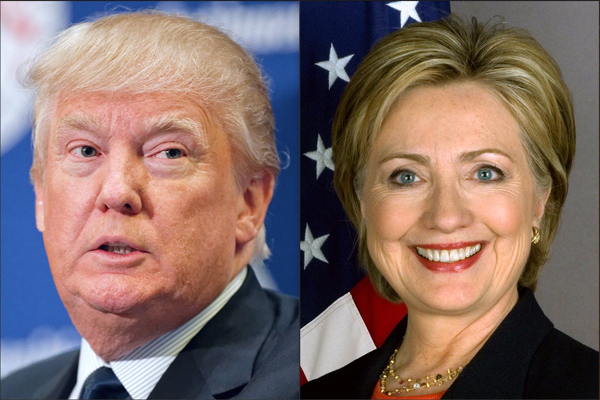
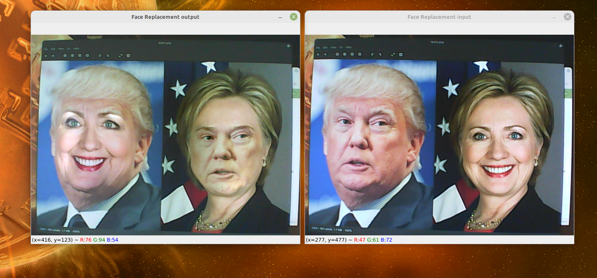

# RealTime-FaceReplacement

**This project proposes a method for real-time face replacement using a webcam. Most of the current researches on face replacement techniques are based on static face replacement techniques. Those studies focused on how to achieve face replacement between people in two photographs. This paper is devoted to achieving real-time face replacement based on the static face replacement technique. Ultimately, real-time face replacement technique has been implemented by merging the algorithms of face recognition, convex hull, Delaunay triangulation, and Poisson equation. In addition, there is also face colour contrast after real-time face replacement was performed. The colour difference between the central part of the new face and the original face was significant in comparison to the colour difference between the boundaries of both the new face and original face. The results also show that there are some limitations of the real-time face replacement function. The limitations include differences in face size, facial occlusions, and the rotation angle of the face in which they have a great impact on the outcome.**

Swap face between two face for Python 3 with OpenCV, numpy and dlib.

## Get Started
```sh
bash run.sh
```
## Install 

### Requirement

* `pip install opencv-python`
* `pip install dlib`
* `pip install numpy`

Note: See [requirements.txt](requirements.txt) and [run.sh](run.sh) for more details.

### Git Clone

```bash
git clone https://github.com/GongzaiLi/RealTime-FaceReplacement.git
```

### File Structure
```
.
├── README.md
├── imgs
│    ├── Step_10.png
│    ├── Step_11.png
│    ├── Step_12.png
│    ├── Step_13.png
│    ├── Step_14.png
│    ├── Step_15.png
│    ├── Step_16.png
│    ├── Step_17_1.png
│    ├── Step_17_2.png
│    ├── Step_18_1.png
│    ├── Step_18_2.png
│    ├── Step_3.png
│    ├── Step_5.png
│    ├── Step_6.png
│    ├── Step_7.png
│    ├── Step_8.png
│    ├── Step_9.png
│    ├── face_landmarks.gif
│    ├── output6_7.jpg
│    ├── output7_6.jpg
│    ├── result.png
│    ├── step_1.png
│    ├── step_2.png
│    ├── step_4.png
│    ├── test1.jpg
│    ├── test2.jpg
│    ├── test3.jpg
│    └── test4.png
├── main.py
├── models
│    ├── shape_predictor_68_face_landmarks.dat
│    └── shape_predictor_81_face_landmarks.dat
├── reference # reference code
│    ├── main_photo.py
│    ├── photos_face_swapping.py
│    └── realtime_face_swapping.py
├── requirements.txt
├── run.sh
├── tree.text
└── utils
    ├── calculate_mask.py
    ├── delaunay_triangulation.py
    ├── face_swap.py
    ├── helper.py
    └── warp_trianglation.py
```
## Results

| From                | To                   |
| ------------------- | -------------------- |
|  |  |
